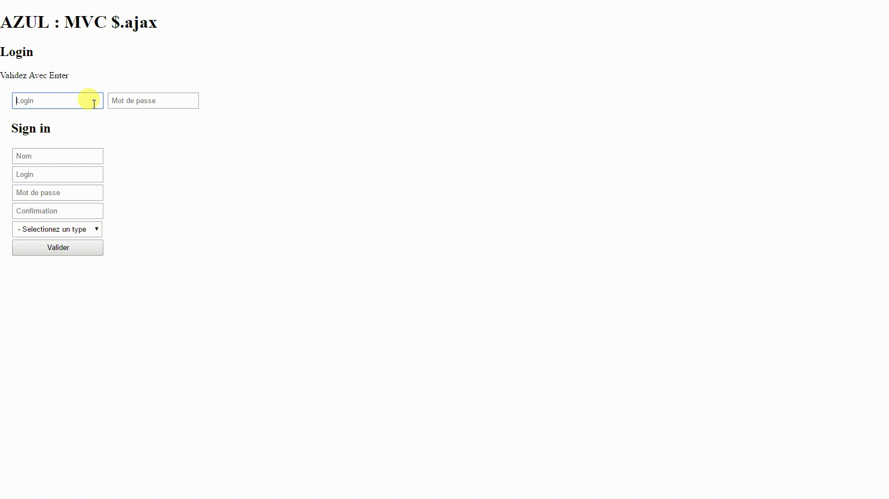

Sample $.ajax
=============

Simple AJAX example : login, signin



Links
-----

OOP with PHP[FR][oopfr][EN][oopen]<br>
[JQuery][j1]<br>
[JQuery-ui][j2] (For Animation)<br>

$.ajax
------

```js
$.ajax(
	url:"",
	data:{},
	type:"POST",
	success:function(){}
);
```

 [oopfr]: http://php.net/manual/fr/language.oop5.php
 [oopen]: http://php.net/manual/en/language.oop5.php
 [j1]: http://api.jquery.com/ 
 [j2]: http://jqueryui.com/effect/
